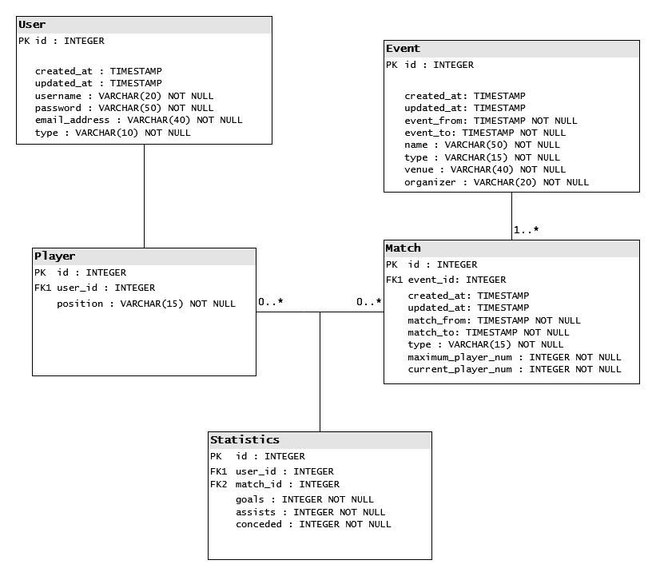
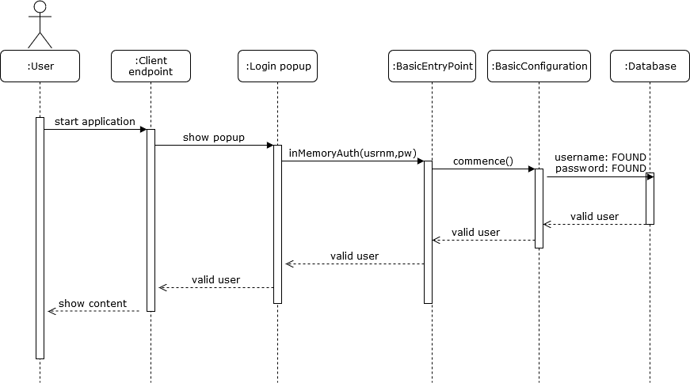
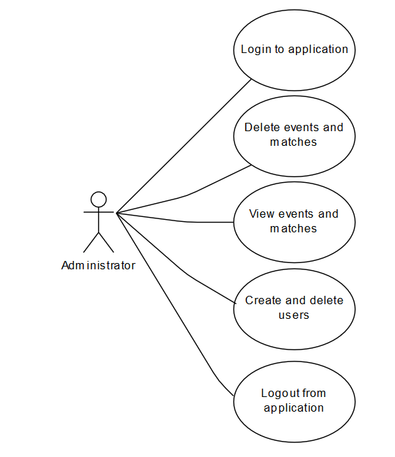
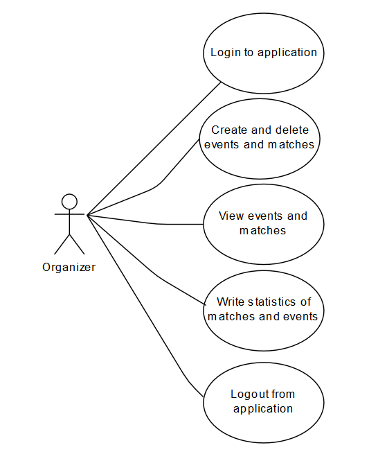
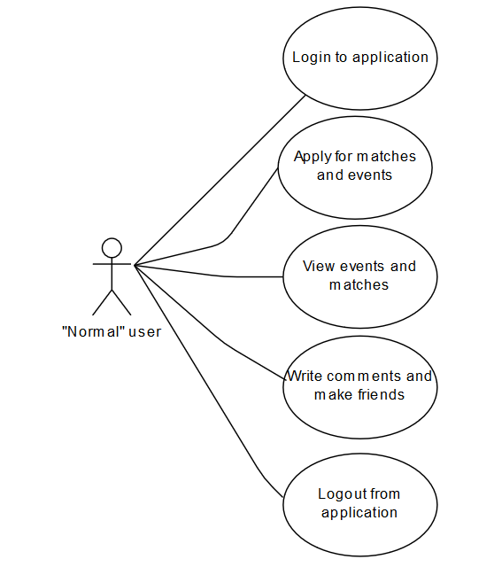

# Ballerz

### Hogy mi is ez?

Előfordult már Veled valaha, hogy egy hosszú nap végén már csak arra vágytál, hogy végre lemehess a grundra és rúghasd a bőrt, de nem volt kivel? A Ballerz applikáció egy kényelmes és egyszerű megoldást biztosít arra, hogy ez többet ne fordulhasson elő Veled! Csak regisztrálj, és válogass a kitűzött mérkőzések között és csatlakozz másokhoz, vagy hozz létre saját eseményt!

### Az alkalmazás funkcionális követelményei

 - A felhasználók regisztrálhatnak, a későbbiekben pedig ezekkel a hitelesítő adatokkal jelentkezhetnek majd be az alkalmazásba.
 - A regisztrált felhasználók létrehozhatnak eseményeket, vagy csatlakozhatnak mások által létrehozottakhoz.
 - A felhasználók kedvencnek jelölhetnek helyszíneket, rendszeres eseményeket, szervezőket, amelyek a hírfolyamban is priorítást élveznek majd.
 - A szervezőknek, helyszíneknek saját oldaluk is lesz, a specifikus információkkal.
 - Helyszíneket és szervező felhasználókat csak rendszeradminisztrátorok hozhatnak létre.
 - A felhasználóknak lehetősége van arra, hogy az események alá hozzászólásokat írjanak.

### Az alkalmazás nem funkcionális követelményei

 - Az alkalmazásnak átláthatónak és könnyen kezelhetőnek kell lennie.
 - Az alkalmazásnak az adatokat biztonságosan kell kezelnie és tárolnia, kiváltképpen az érzékeny hitelesítő adatokat, amelyek az autentikációhoz szükségesek.
 - Az alkalmazásnak gyors válaszidejűnek kell lennie.
 - Az alkalmazásnak szinte folyamatosan, minimális rendszerleállásokkal kell működnie a problémák elkerülése miatt.
 - A rendszer adatbázisának jól szervezettnek kell lennie, a dinamikusságot elősegítve.

### Szakterületi fogalomjegyzék

 - mérkőzés: egy olyan esemény, ahol játékosok által alkotott csapatok csapnak össze és az nyeri meg, amelyik több gólt szerez
 - gól: az az esemény, amikor a labda áthalad a gólvonalon
 - gólpassz: a gólszerző játékosnak a gól szerzése előtt adott utolsó passz
 - kapott gól nélküli mérkőzés: olyan mérkőzés, ahol a csapat kapott gól nélkül fejezi be a meccset
 - bajnokság: több mérkőzésből álló versenysorozat, melyet a döntő mérkőzés győztes csapata nyer meg

### Szerepkörök

 - (regisztrált) felhasználó: általános felhasználó, akinek lehetősége van arra, hogy eseményeket szervezzen és eseményeken vegyen részt
 - szervező: olyan regisztrált felhasználó, akinek csak eseményszervezésre van lehetősége
 - moderátor: olyan felhasználó, akinek joga van az eseményekhez fűzött kommenteket, valamint az azokat író felhasználókat moderálni
 - rendszeradminisztrátor: olyan felhasználó, akinek joga van szervezőket, helyszíneket létrehoznia, moderátori jogokkal bír, valamint természetesen az egyszerű felhasználó jogai is megilletik

### Fejlesztői környezet, használt technológiák

#### A backend-hez használt technológiák

A fejlesztés során a **Spring** keretrendszer (legfrissebb stabil *2.2.0*-ás verziójának) segítségével készítünk el egy **Java** (*8*) alapú alkalmazást, melynek menedzselésének és build folyamatának automatizálása során a **Maven**t hívjuk segítségül. A fejlesztés során az **Apache NetBeans** (*11*) integrált fejlesztői környezetet használjuk.
A Spring Boot **függőségek** közül az alábbiakat vesszük igénybe:
 - Spring Data JPA *(Spring Data-át és Hibernate-et használva a Java Persistence API segítségével SQL-ben tárolja az adatokat)*,
 - Spring Boot DevTools *(gyors alkalmazás újraindításokat, valós idejű újratöltést és különböző konfigurációs lehetőségeket biztosít)*,
 - H2 Database *(gyors memóriában tárolt adatbázist biztosít, ami támogatja a JDBC API-t)*,
 - Lombok *(annotációkat tartalmazó könyvtár a kód elburjánzás megelőzésének érdekében)*,
 - Spring Web *(támogatja a webes alkalmazások készítését, kiváltképp a REST alapokon mozgókét SPRING MVC felhasználásával)*,
 - Spring Security *(testreszabható autentikációs és elérés-kezelő keretrendszer)*.

#### A frontend-hez használat technológiák

A fejlesztés során az **Angular** keretrendszert használjuk, melyhez szükség van a **Node.js** (legfrissebb stabil *12.13.1*-es verziójú) szoftverrendszerre és az ehhez tartozó **NPM** (*6.12.1*-es verziójú) csomagkezelőre.
A telepítés sikerességét az alábbi parancsok (parancssorban való) futtatásával ellenőrizhetjük (azaz megtudhatjuk a verziószámokat):

```
node -v
npm -v
```
A keretrendszer használatához szükségünk lesz még a **TypeScript** telepítésére, amely lehetővé teszi, hogy a **JavaScript** nyelv segítségével skálázható alkalmazást készítsünk, valamint telepítenünk kell az **Angular CLI** szoftvert is (*Angular Command Line Interface*), amely lehetővé teszi a parancssorból való segédműveleteket, amelyek által jóval gyorsabb és kényelmesebb lesz a fejlesztés. A felhasználói felület elkészítéséhez a **Material UI** eszközeit használjuk az egyes komponensek elkészítéséhez, a rácsos elrendezéshez pedig a **flex-layout**-ot..
A telepítéshez (ha a fentebb említett eszközöket már telepítettük) az alábbi utasításokat kell (parancssorban) lefuttatni:

```
npm install -g typescript
npm install -g @angular/cli
npx ng add @angular/material
npm install @angular/flex-layout --save
```

A kódoláshoz a nyílt forráskódú *Microsoft* által fejlesztett **Visual Studio Code** (*1.40*) szoftvert használjuk, amely a hibakereső és Git támogatással hozzájárul a hatékony és zökkenőmentes fejlesztéshez. 

### Adatbázis-terv (UML)



### Alkalmazott könyvtárstruktúra

Az alkalmazás elkészítése során törekedtünk a lehető legegyszerűbb, legészszerűbb és legátláthatóbb könyvtárstruktúra kialakítására, ezért szorosan ragaszkodtunk az objektumorientált szemléletmód és az ehhez ezer szállal kötődő Java nyelv által elterjedt felépítéshez.

#### Programkönyvtár gyökere

TODO: a leírás kiegészítése az új fájlokkal

* **.git mappa** *(verziókezelő számára szükséges fájlokat és almappákat tartalmaz)*
* **.mvn mappa** *(a Maven build rendszer számára szükséges fájlokat és almappákat tartalmaz)*
* **src mappa** *(a program forráskódját, valamint néhány a fordításhoz és az egyes Spring Boot komponensek kielégítő működéséhez információt tároló konfigurációs fájlt tartalmazó mappa)*
   * **main mappa** *(a forráskód lényegi része, az objektumok implementációja)*
      * **java mappa** *(a mappa tartalmazza a forráskód package-ek szerint tagolt mappaszerkezetét)*
         * **hu mappa** *(a hu package-et jelképező mappa)*
            * **elte mappa** *(az elte package-et jelképező mappa)*
               * **ballerz mappa** *(a ballerz package-t jelképező mappa)*
                  * **controllers mappa** *(a mappa tartalmazza azokat a forrásfájlokat, amelyek az egyes entitásokat kezelik a REST alapú alkalmazás elvei szerint, különböző mapping-eket hajthatunk végre velük)*
                  * **entities mappa** *(a mappa tartalmazza azokat a forrásfájlokat, amelyek megvalósítják az egyes entitásokat)*
                  * **repositories mappa** *(a mappa tartalmazza azokat a forrásfájlokat, amelyek az egyes entitások számára lehetővé teszik a CRUD hívásokat)*
                  * **security mappa** *(a mappa tartamazza az autentikációhoz szükséges forrásfájlokat)*
                  * **utils mappa** *(a mappa különböző mellékes forrásfájlokat tartalmaz, főleg különböző felsorolókat)*
                  * **BallerzApplication.java** *(az alkalmazás belépési pontját tartalmazó forrásfájl)*
      * **resources mappa** *(a mappa tartalmazza a programhoz szükséges "nyersanyagokat", azokat a fájlokat, amelyek nem nevezhetőek kifejezetten forráskódnak, mégis elengedhetetlenek a kielégítő működéshez)*
         * **application.properties** *(tartalmazza az alkalmazás egyes függőségeinek értékadás-szerű utasításokkal való konfigurációját)*
         * **data.sql** *(a H2 Database számára szükséges SQL forrásfájl, amely tartalmazza azokat az utasításokat, amelyeket az adatbázisban a program futása előtt el kell végezni)*
         * **ballerz.png** *(az adatbázis UML diagramját ábrázoló kép)*
         * **sequence.png** *(a végpontok működésének szekvenciadiagramját ábrázoló kép)*
         * **uc_admin.png** *(az adminisztrátor hozzáférési jogait bemutató use-case diagram)*
         * **uc_user.png** *(a szervező hozzáférési jogait bemutató use-case diagram)*
         * **uc_org.png** *(a felhasználó hozzáférési jogait bemutató use-case diagram)*
         * **in_use.png** *(az alkalmazás használatát bemutató kép)*
   * **test mappa** *(az implementációkhoz készített tesztesetek, ahol ezt a jellegük indokolja, avval azonos struktúrában)*
* **target mappa** *(a forrásfájlok alapján legenerált class és egyéb konfigurációs fájlokat, valamint az alkalmazás futtatható verzióját tartalmazza)*
* **.gitignore** *(a fájl tartalmazza azokat a fájlokat (vagy mintákat), amelyeket a verziókezelő rendszernek figyelmen kívül kell hagynia)*
* **HELP.md** *(tartalmaz néhány hasznos linket, amelyek segíthetnek a Spring Boot egyes komponenseinek megértésében, ezt a fájlt a Spring Initalizr generálja)*
* **mvnw és mwnw.cmd** *(a Maven-Wrapper-hez szükségesek, letöltik a megfelelő Maven verziót (ha nem találja), lehetővé teszik a Maven futtatását akkor is, ha azt nem találják a számítógépen - a mvnw a Linux rendszereken, a mvnw.cmd pedig a Windows rendszerek használható)*
* **nbactions.xml** *(a NetBeans fejlesztőkörnyezet által használt konfigurációs fájl, amely leírja, hogy melyik Maven "célokat (goals)" kell alkalmaznia)*
* **pom.xml** *(a Maven által használt konfigurációs fájl, amely információkat tartalmaz a projektről és annak felépítéséről, kezdve annak nevétől, a package-ek strúktúráján át az egyes függőségek leírásáig minden fontos adattal a build folyamatról és az egyes pluginokról)*
* **README.md** *(a verziókövető rendszer (pl. Git) által alkalmazott szöveges fájl, mely arra szolgál, hogy a projekt iránt érdeklődők tájékozódhassanak azokról a fontos információkról, amelyeket a fejlesztők megosztanának velük (például a könyvtárstruktúra részletes leírását, remélem mindenki elolvassa idáig haha))*
* **balerz-client mappa** *(a mappa tartalmazza az Angular segítségével elkészített, frontend felületet megvalósító kliens oldali alkalmazást <<ezt a mappát kell a VSCode segítségével megnyitni>>)*
  * **e2e mappa** *(az E2E az End-2-End rövidítése, amely a tesztelésre vonatkozik, tehát a mappa a kezdetektől a végletekig való teszteléshez tartalmaz fájlokat - ez teszi lehetővé, hogy tesztelésre kerüljön minden komponens, valamint az azok alkotta egész)*
    * **tsconfig.json** *(ebben lehet megadni a teszteléshez az elérési utakat)*
    * **protractor.conf** *(a Protactor end-to-end tesztelő keretrendszerhez szükséges fájl)*
    * **src mappa** *(forrásfájlokat tartalmaz)*
      * **app.e2e-spec** *(tartalmazza a konkrét teszteseteket)*
      * **app.po** *(creates the page object)*
  * **src mappa** *(forrásfájlokat tartalmaz)*
    * **app mappa** *(forrásfájlokat tartalmaz)*
      * **event-detail mappa** *(forrásfájlokat tartalmaz)*
        * **event-detail.component.html** *(az elemek elrendezkedésének leírása)*
        * **event-detail.component.css** *(az elemek kinézetének leírása)*
        * **event-detail.component.ts** *(az interakciók leírása amelyek a felületre kattintva történnek)*
        * **event-detail.component.spec.ts** *(a Karma teszt futtató által generált fájl)*
      * **event-form mappa** *(forrásfájlokat tartalmaz)*
        * **event-form.component.html** *(az elemek elrendezkedésének leírása)*
        * **event-form.component.css** *(az elemek kinézetének leírása)*
        * **event-form.component.ts** *(az interakciók leírása amelyek a felületre kattintva történnek)*
        * **event-form.component.spec.ts** *(a Karma teszt futtató által generált fájl)*
      * **event-list mappa** *(forrásfájlokat tartalmaz)*
        * **event-list.component.html** *(az elemek elrendezkedésének leírása)*
        * **event-list.component.css** *(az elemek kinézetének leírása)*
        * **event-list.component.ts** *(az interakciók leírása amelyek a felületre kattintva történnek)*
        * **event-list.component.spec.ts** *(a Karma teszt futtató által generált fájl)*
      * **login-form mappa** *(forrásfájlokat tartalmaz)*
        * **login-form.component.html** *(az elemek elrendezkedésének leírása)*
        * **login-form.component.css** *(az elemek kinézetének leírása)*
        * **login-form.component.ts** *(az interakciók leírása amelyek a felületre kattintva történnek)*
        * **login-form.component.spec.ts** *(a Karma teszt futtató által generált fájl)*
      * **routing mappa** *(forrásfájlokat tartalmaz)*
        * **routing.module.ts** *(beállítja a további végponteléréseket)*
      * **status-filter mappa** *(forrásfájlokat tartalmaz)*
        * **status-filter.component.html** *(az elemek elrendezkedésének leírása)*
        * **status-filter.component.css** *(az elemek kinézetének leírása)*
        * **status-filter.component.ts** *(az interakciók leírása amelyek a felületre kattintva történnek)*
        * **status-filter.component.spec.ts** *(a Karma teszt futtató által generált fájl)*
      * **app.component.html** *(az elemek elrendezkedésének leírása)*
      * **app.component.css** *(az elemek kinézetének leírása)*
      * **app.component.ts** *(az interakciók leírása amelyek a felületre kattintva történnek)*
      * **app.component.spec.ts** *(a Karma teszt futtató által generált fájl)*
      * **auth.guard.ts** *(az authorizációhoz szükséges)*
      * **auth.guard.spec.ts** *(a Karma teszt futtató által generált fájl)*
      * **auth.service.ts** *(az authorizációt bonyolítja le, kommunikál a backend-del)*
      * **auth.service.spec.ts** *(a Karma teszt futtató által generált fájl)*
      * **event.service.ts** *(az eseményekhez tartozó lehetőséges és történések kezelése, működőképessé teszi a világmindenséget, kommunikál a backend-del)*
      * **event.service.spec.ts** *(a Karma teszt futtató által generált fájl)*
      * **event.ts** *(Event - esemény - típus leírása)*
      * **event.spec.ts** *(a Karma teszt futtató által generált fájl)*
      * **user.ts** *(User - felhasználó- típus leírása)*
      * **user.spec.ts** *(a Karma teszt futtató által generált fájl)*
      * **app.module.ts** *(végpont eléréseket kezeli)*
    * **assets mappa** *(forrásfájlokat tartalmaz))*
      * **.gitkeep** *(tartlmazza azokat a fájlokat amelyeket a verziókezelőrendszernek meg kell tartania, mikor frissít)*
    * **environments mappa** *(forrásfájlokat tartalmaz))*
      * **environment** *(átlagos környezet)*
      * **environment.prod** *(production környezet)*
    * **resources mappa** *(képeket tartalmaz)*
      * **background.png** *(az oldal háttere)*
    * **favicon.ico** *(a fejlécben megjelenő ikon)*
    * **index.html** *(főoldal html kódja)*
    * **main.ts** *(az alkalmazás belépési pontja)*
    * **polyfills.ts** *(lehetővé teszi több böngésző számára a kompatibilitást)*
    * **styles.css** *(minden elemre érvényes stíluselemek leírása)*
    * **test.ts** *(teszteléshez szükséges belépési pont)*
  * **.editorconfig** *(tartalmazza a szövegszerkesztő beállításait)*
  * **angular.json** *(konfigurációs és egyéb beállításokat tartlmaz például az Angular CLI számára)*
  * **browserlist** *(tartalmazza az alkalmazás által támogatott böngészőket)*
  * **karma.conf** *(a Karma automata tesztelő keretrendszer konfigurációs fájlja)*
  * **package.json** *(a Node.js számára szükséges függőségeket tartja nyílván)*
  * **package-lock.json** *(a függőséges listájának "fáját" tartja nyílván)*
  * **README.md** *(fejlesztői feljegyzéseket tartalmaz)*
  * **tsconfig.app.json** *(projekt specifikus TypeScript konfigurációs fájl)*
  * **tsconfig.json** *(a TypeScript konfigurációs fájlja)*
  * **tsconfig.spec.json** *(a Karma és Protractor által generált tesztleíró fájl)*
  * **tslint.json** *(szabályleíró az alkalmazáshoz)*

### Végpont-tervek és leírások

#### Az alkalmazás egyszerű végpontjai

Az alábbi végpontok az egyes entitásokat jelképezik.

* ```../events```
* ```../matches```
* ```../players```
* ```../statistics```
* ```../users```

#### H2 Database végpontja

Az alábbi végponton érhető el a H2 Database adatbáziskezelő felülete, természetes kizárólag autentikáció után (ez az adatbázis saját autentikációját használja).

* ```../h2-console```

#### Hiba végpont

Amennyiben az alkalmazás futása során hiba következik be, esetleg a felhasználó kérése nem megvalósítható, az alábbi végpontra kerül a felhasználó.

* ```../error```

#### A végpontok működésének leírása

A leírást szekvenciadiagram formájában mutatjuk be, ez a viselkedés jellemző minden eddigi végpontra.



### Specifikumok

Egyelőre az alkalmazás nem tartalmaz említésre méltó specifikumot.

### Szerepkörök hozzáférési jogai

Az alábbi használati eset diagramok szemléltetik azt, hogy az egyes szerepkörök mely elemekhez férnek hozzá.
Ha egy szerepkör hozzáfér egy funkcióhoz, az azt jelenti, hogy elér minden olyam gombot, mezőt, listát amely ehhez tartozik, viszont nem lát semmi olyat, amihez ne lenne joga.

#### Adminisztrátor



#### Szervező



#### Felhasználó



### Kliensoldali szolgáltatások listája

* Bejelentkezés az alkalmazásba *(a megfelelő felhasználónév - jelszó kombinációkkal be lehet jelentkezni az alkalmazásba, a további funkciók eléréséenk érdekében)*;
* események létrehozása *(létrehozhatunk új események a neve, helyszíne, és szervezőjének és típusának megadásával - ezután a felhasználók jelentkezhetnek erre az eseményre)*;
* események listázása *(az eseményeket ki is lehet listáztatni, hogy lássuk, miből lehet választani)*;
* események részleteinek megtekintése *(egy esemény nevére kattintva, megtekinthetjük annak részletes leírását)*;
* mérkőzések létrehozása *(létrehozhatunk mérkőzéseket az egyes eseményekhez, a nevük, helyszínük, szervezőjük megadásával)*;
* mérkőzések listázása *(kilistáztathatjuk a mérkőzéseket)*;
* kijelentkezés az alkalmazásból *(kijelentkezhetünk az alkalmazásból)*.

### Funkciók működésének leírása

#### Bejelentkezés az alkalmazásba

1. Látogassuk meg a **http://localhost:4200/login** oldalt.
2. A felső menüben kattintsunk a *Login* gombra.
3. Kattintsunk a *username* felirattal jelölt mezőbe.
4. Vigyük be a mezőbe például a *kiszeltunde* szöveget.
* Ekkor bemásolódik a *kiszeltunde* a **username** változó értékébe.
5. Kattintsunk a *password* felirattal jelölt mezőbe.
6. Vigyük be a mezőbe a *password* szöveget.
* Ekkor bemásolódik a *password* a **password** változó értékébe.
7. Kattintsunk az *Enter* felirattal jelölt gombra.
* Ekkor meghívódik az **AuthService** osztály **login(string, string)** metódusa.
  * A metódus egy **POST** requestet küld a *backend* számára, amely a **http://localhost:8080/** címen fut-szalad.
  * A *backend* fogadja a kérést, majd **BCrypt** eljárással hash-eli a jelszót, mivel az adatbázisban is ilyen formában tároljuk ezt (biztonsági okoból).
  * Amennyiben megtalálható az adott felhasználónév-jelszó párossal tarkított adat a felhasználók között, jelzi ezt (vagy ennek ellenkezőjét) a *frontend* számára, amely kiértékeli a választ.
    * Amennyiben helyesek voltak az adatok, a felhasználót bejelentkezetté teszi és továbbítja a **http://localhost:4200/events** címre.
    * Amennyiben hibásak az adatok, jelzi ezt a felhasználó számára.

### Felhasználói dokumentáció

Az alábbiakban olvashatjuk a felhasználói dokumentációt.

#### Rendszerkövetelmények

* Operációs rendszer: Windows
* Memória: minimum 8 GB
* Processzor: minimum Intel i7
* Szabad tárhely: minimum 1 GB

#### A használat módja

Ahhoz, hogy a programot használhassuk, az alábbi lépéseket kell megtennünk:

* Töltsük le a forrásállományokat innen, a **Github**-ról. Ezt két módon is megtehetjük:
  * Jobb oldalon felül kattintsunk a **Download**, a letöltés után pedig tömörítsük ki.
  * Ha a számítógépünkra van **Git** telepítve, akkor parancssorban futtassuk a ```git clone https://github.com/gonczmisi/Ballerz``` parancsot.
* A létrejött Ballerz mappát nyissuk meg **NetBeans** segítségével.
  * **Clean and Build** után futassuk (*Run*).
* A Ballerz mappában található ballerz-client almappát nyissuk meg **Visual Studio Code** segítségével és nyissunk terminált.
  * ```npm install```
  * ```npm audit fix``` (*opcionális*)
  * ```npm start```
* Az oldalt elérhetjük, ha a böngészőbe beírjuk a **http://localhost:4200** címet.

##### Igénybe vehető szolgálgatások

* Bejelentkezés az alkalmazásba;
* események listázása;
* események hozzáadása;
* események törlése;
* kijelentkezés az alkalmazásból.


#### Hibák oka és elkerülése

A hiba oka az alkalmazás gyenge minőségben való megírása, az elkapkodott és összecsapott munka, amelynek a készítők is áldozataik.
Nem vagyunk büszkék az elkészült programra, mert nem tükrözi azt, hogy milyen minőségben szoktunk dolgozni.
A félév vége sajnos a nagyon sűrű, így alig másfél napunk maradt arra, hogy elkészítsük az alkalmazást, ezért elnézést kérünk.

A hibák elkerülésének egyetlen módja van:
* **NE HASZNÁLJUK EZT AZ ALKALMAZÁST!**

#### Példa a használatra

Körülbelül ilyen érzés használni az alkalmazást:


